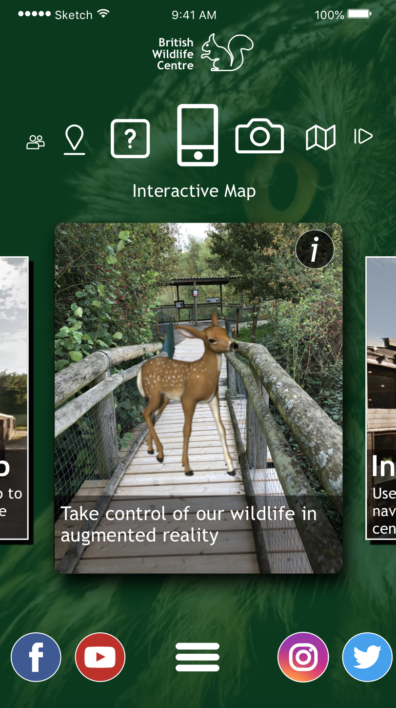
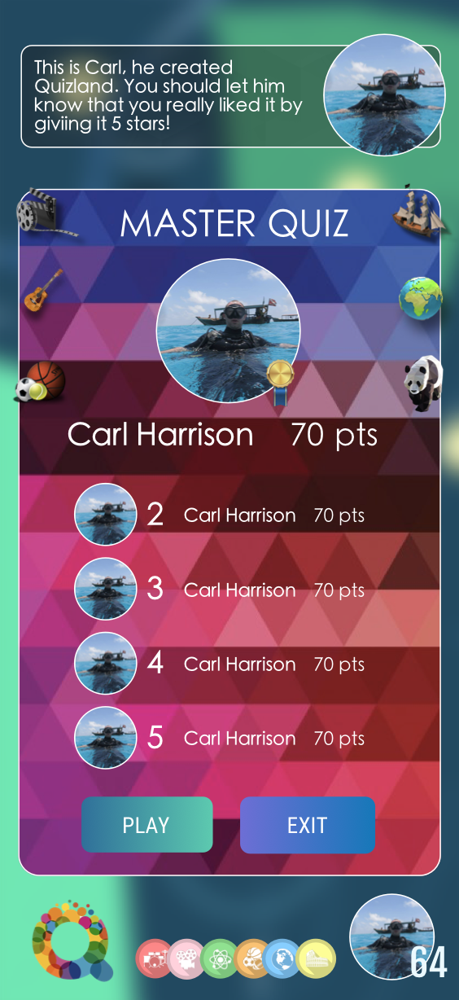
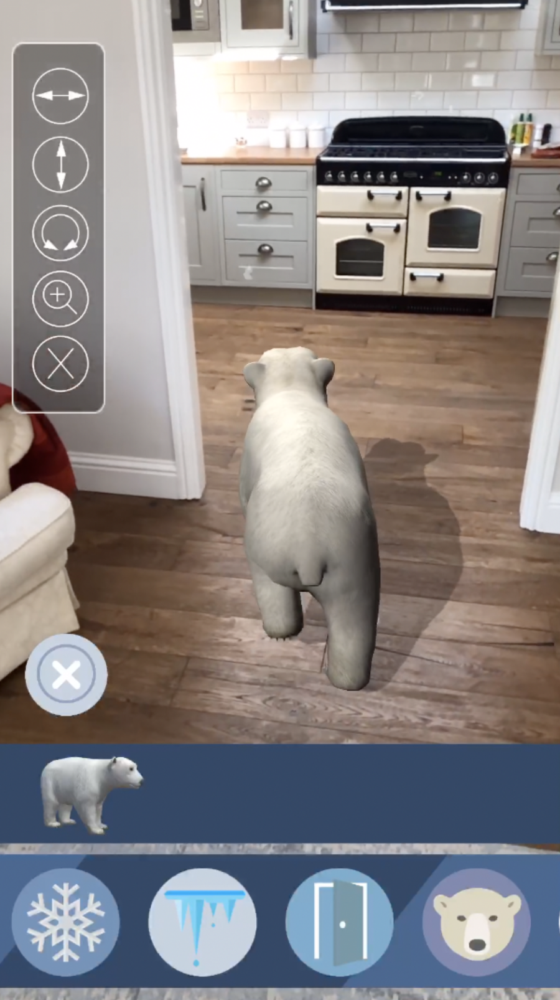

## Carl Harrison - 👨🏻‍💻 👋

I'm a software developer experienced in AR Unity development, test automation and front end design/development.

I've spent the majority of my career as a QA engineer and am currently working on the Spark AR product at Facebook as a QA engineer. I'm lucky enough to be working in a world class team on an outstanding product!

Addicted to self-progression and learning, I can always be found on something like Codecademy or Pluralsight trying something new. Below are a few snapshots of the products you'll find in my repos. AR has ben a passion of mine since I came across ARkit in Unity a few years ago.

 

  

 

## My Tech Stack :computer:
            

## What I Am Learning :books:
   

